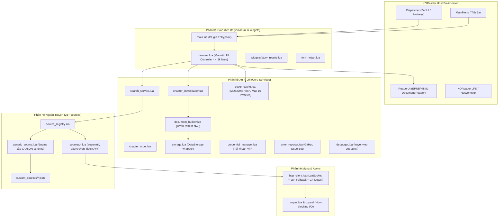
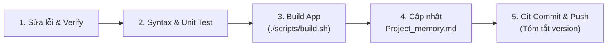

# Project Memory: Z-Truyenviet.koplugin

Tài liệu lưu trữ bộ nhớ dự án, tổng hợp kiến trúc, tình trạng kỹ thuật hiện tại, danh mục nguồn truyện, các bài học kinh nghiệm qua các phiên bản và quy trình vận hành/phát triển cho plugin **Truyện Việt** trên hệ điều hành **KOReader**.

---

## 1. Thông tin chung & Tình trạng phiên bản

| Thuộc tính | Chi tiết |
| :--- | :--- |
| **Tên Plugin** | `truyenviet` (Hiển thị: *Truyện Việt*) |
| **Mục tiêu** | Tìm kiếm, duyệt danh mục, tải về và đọc truyện chữ / truyện tranh trực tiếp từ các website truyện Việt Nam trên máy đọc sách chạy KOReader (Kindle, Kobo, Android, v.v.). |
| **Phiên bản hiện tại** | Codebase: `v3.10.0` (`BUILD-1370`) |
| **Ngôn ngữ & Runtime** | LuaJIT (tương thích môi trường Lua 5.1/LuaJIT của KOReader) |
| **Async Engine** | Copas 4.x + LuaSocket + Timerwheel + Binaryheap |
| **Kho lưu trữ Git** | `https://github.com/magicxlll/Z-Truyenviet.koplugin.git` (nhánh `main`) |
| **Build Artifact** | `dist/truyenviet.koplugin.zip` |

---

## 2. Kiến trúc Hệ thống (System Architecture)



### Bản đồ Module và Trách nhiệm:

1. **`main.lua`**: Điểm vào của plugin, đăng ký menu KOReader, nút topbar, và các hành động Dispatcher (`start_truyenviet`, `truyenviet_continue`, `truyenviet_history`, `truyenviet_downloaded`, v.v.). Tương thích ZenUI thông qua gán `plugin = true`.
2. **`truyenviet/browser.lua`**: Controller giao diện trung tâm điều hướng tất cả menu (duyệt nguồn, tìm kiếm, xem chi tiết truyện, chọn chương, tải chương, lịch sử, cài đặt). Hiện tại là module nguyên khối lớn (>4,200 dòng).
3. **`truyenviet/http_client.lua`**: Quản lý request HTTP/HTTPS với cơ chế fallback kép:
   - Thử `socket.http` nội tại.
   - Nếu gặp SSL khắt khe hoặc handshake lỗi, tự động chuyển sang gọi lệnh CLI `curl -skSL` ở tầng OS.
   - Nhận diện màn hình xác thực Cloudflare Challenge.
4. **`truyenviet/source_registry.lua`**: Đăng ký và nạp các nguồn truyện tích hợp sẵn và tải động các nguồn từ thư mục `custom_sources/*.json`.
5. **`truyenviet/chapter_downloader.lua`**: Quản lý tiến trình tải chương đồng bộ hoặc bất đồng bộ qua Copas, tránh nghẽn UI của máy đọc sách.
6. **`truyenviet/document_builder.lua`**: Dựng file đọc dạng HTML/EPUB lưu trữ cục bộ cho KOReader mở, tích hợp làm sạch CSS và lọc quảng cáo.
7. **`truyenviet/credential_manager.lua`**: Quản lý tài khoản đăng nhập (VIP) của các nguồn yêu cầu xác thực (AkayTruyen, TVE-4U).
8. **`truyenviet/storage.lua`**: Đọc/ghi cấu hình và trạng thái qua `datastorage` của KOReader.

---

## 3. Danh mục 21+ Nguồn truyện (Source Catalog)

| ID | Tên Nguồn | Tên miền mặc định | Loại | Kỹ thuật cào | Ghi chú đặc biệt |
| :--- | :--- | :--- | :--- | :--- | :--- |
| `truyenfull` | Truyện Full | `https://truyenfull.io` | Text | HTML Regex | Nguồn phổ biến, hỗ trợ pagination regex |
| `truyenqq` | Truyện QQ | `https://truyenqqto.com` | Comic | HTML Regex | Truyện tranh, cào danh sách ảnh chương |
| `dualeo` | Dưa Leo Truyện | `https://dualeotruyen5.com` | Comic | HTML Regex | Truyện tranh |
| `truyendich` | Truyện Dịch | `https://truyendich.com` | Text | HTML Regex | Danh mục phong phú |
| `cbunu` | Cbunu | `https://cbunu.com` | Text | HTML + Session | Cần quản lý Set-Cookie trang chủ |
| `haccbl` | Hắc Cbl | `https://haccbl.top` | Text | HTML + AES/PBKDF2 | Giải mã nội dung chương mã hóa JS |
| `giatocvuongtai` | Gia Tộc Vương Tài | `https://giatocvuongtai.com` | Text | JSON/HTML | Parse JSON metadata |
| `docln` | Cổng Light Novel | `https://docln.net` | Text | HTML Regex + RateLimit | Giới hạn 1.2s/request chống chặn IP |
| `tve4u` | TVE-4U | `https://tve-4u.org` | Forum | XenForo API/HTML | Diễn đàn ebook, yêu cầu đăng nhập |
| `dilib` | DiLib | `https://dilib.vn` | Text | REST/HTML | Hỗ trợ phân trang và tìm kiếm |
| `mizzya` | Mizzya | `https://mizzya.com` | Text | HTML Regex | Nguồn truyện nhẹ |
| `metruyenvn` | Mê Truyện VN | `https://metruyen.net.vn` | Text | HTML Regex | Phân trang và tìm kiếm theo danh mục |
| `aztruyen` | AZ Truyện | `https://aztruyen.com` | Text | HTML Regex | Nhiều danh mục hot/hoàn thành |
| `dualeotruyenfull`| Dưa Leo Full | `https://dualeotruyenfull.com` | Text | HTML Regex | Phiên bản chữ |
| `truyenc` | Truyện C | `https://truyenc.com` | Text | HTML Regex | Cover URL thường chứa khoảng trắng thô |
| `akaytruyen` | Akay Truyện | `https://akaytruyen.com` | Text | AJAX/HTML + VIP Auth | Cache DOM section, endpoint `/search-chapters` |
| `storyaclick` | Story A Click | `https://storyaclick.com` | Text | HTML Regex | Nguồn mới |
| `blhvip` | BLH VIP | `https://api.blhvip.vn` | Text | **REST API (JSON)** | Cào qua REST API backend, nhanh & ổn định |
| `metruyenchuvn` | Mê Truyện Chữ VN | `https://metruyenchuvn.com` | Text | HTML Regex | Parsing DOM chuẩn |
| `conduongbachu` | Con Đường Bá Chủ | `https://conduongbachu.com` | Text | **WordPress REST API** | `/wp-json/wp/v2/posts`, kiểm tra `X-WP-Total` |
| `xtruyen` | X-Truyện | `https://xtruyen.vn` | Text | **Zlib + Base64 decode** | Giải mã chuỗi mã hóa `data_x` qua `ffi/zlib` |

---

## 4. Các bài học kinh nghiệm xương máu (Lessons Learned)

### 4.1. Ưu tiên REST API ngầm thay vì Regex HTML
- **Bài học:** Cào HTML truyền thống (`string.match`) dễ vỡ khi web đổi layout. Điển hình: `blhvip` dùng REST API (`api.blhvip.vn/v1/...`) và `conduongbachu` dùng WordPress REST API (`wp-json/wp/v2/posts`) giúp code gọn hơn 70%, tốc độ phản hồi nhanh hơn gấp nhiều lần và không bị ảnh hưởng bởi cập nhật CSS.
- **Quy tắc:** Luôn dùng F12 DevTools (Tab Network -> Filter `Fetch/XHR`) trước khi viết regex HTML.

### 4.2. Xử lý phân trang WordPress REST (`X-WP-Total`)
- **Sự cố BUILD-1324:** Khi cào nguồn `conduongbachu`, nếu một trang request giữa chừng bị timeout, plugin lưu bộ đệm mục lục bị cụt khiến người đọc bị mất chương.
- **Giải pháp:** Chỉ công nhận danh mục hoàn thành khi số lượng bài cào được khớp chính xác với header `X-WP-Total` do server trả về.

### 4.3. Cạm bẫy sắp xếp chương: `Natural Compare` vs Số chương thực tế
- **Sự cố:** `helpers.naturalCompare` quy định kiểu `number` đứng trước `string`. Tiêu đề bắt đầu bằng số như `"201: VÔ ĐỀ."` bị đẩy lên đứng trước `"Chương 1: Khởi đầu"`.
- **Bài học:** Khi sắp xếp danh sách chương, nếu cả hai chương đều bóc tách được số hiệu chương (`a.number` và `b.number`), luôn so sánh số học `a.number < b.number` trước; chỉ fallback sang `naturalCompare` trên chuỗi tiêu đề khi không có số chương.

### 4.4. An toàn Coroutine trong LuaJIT
- **Sự cố:** `ChapterDownloader:download` gọi thẳng `coroutine.yield()` để cập nhật thanh tiến trình. Khi chạy trong luồng chính (main thread) hoặc môi trường test đơn vị mà không được bọc bởi coroutine, LuaJIT sẽ văng lỗi nghiêm trọng: `attempt to yield across C-call boundary`.
- **Giải pháp:** Luôn kiểm tra `if coroutine.running() then coroutine.yield(...) end`.

### 4.5. Tác dụng phụ của Monkey-Patching (`helpers.lua`)
- **Sự cố:** `truyenviet/helpers.lua` ghi đè trực tiếp hàm toàn cục `ko_util.urlEncode = Util.urlEncode`. `Util.urlEncode` mã hóa ký tự `@` thành `%40`, làm sai lệch các đoạn mã kiểm thử hoặc module khác kỳ vọng `@` được giữ nguyên.
- **Bài học:** Hạn chế tối đa việc ghi đè module chia sẻ (`ko_util`). Nên gọi trực tiếp `Util.urlEncode` trong các module thuộc phạm vi plugin.

### 4.6. Vấn đề bộ nhớ (RAM) trên máy đọc sách E-ink
- Thiết bị E-ink thường chỉ có 512MB - 1GB RAM, CPU đơn nhân hoặc tiết kiệm điện.
- Việc log chuỗi nhị phân (ảnh bìa raw) vào file text log từng gây lỗi `400 Problems parsing JSON` khi gửi báo lỗi GitHub và tràn RAM.
- Giới hạn ảnh prefetch cover tối đa 10 ảnh (`max_prefetch = 10`), không bao giờ nạp toàn bộ danh mục ảnh cùng lúc.

### 4.7. Cloudflare Challenge & Bảo mật HTTPS
- Môi trường KOReader chạy curl nhúng với cờ `-skSL` để bỏ qua lỗi chứng chỉ SSL cũ trên máy đọc sách cũ.
- Khi gặp Cloudflare JS challenge, bắt buộc nhận diện chuỗi `window._cf_chl_opt` hoặc `id="challenge-error-text"` để báo lỗi rõ ràng cho người dùng thay vì treo vòng lặp vô tận.

### 4.8. Cơ chế Tải Google Drive: Vượt cảnh báo Virus & Magic Bytes
- Đối với file > 25MB, Google Drive không trả trực tiếp file nhị phân mà trả về trang HTML cảnh báo virus (`confirm=...` hoặc `download_warning`).
- **Giải pháp:** Bóc tách token `confirm` từ form HTML hoặc anchor `id="uc-download-link"`, đồng thời lưu trữ và chuyển tiếp `Cookie` (chứa session download) trong request tiếp theo.
- File Google Drive thường không có tên chuẩn trong Content-Disposition: Tận dụng trích xuất tiêu đề từ `<meta property="og:title">` của trang preview `/file/d/{id}/view`, kết hợp kiểm tra Magic Bytes (`%PDF`, `PK\3\4` EPUB/CBZ, `Rar!` CBR, `BOOKMOBI`) để tự động gán đúng định dạng ebook.

---

## 5. Nợ Kỹ thuật & Tồn đọng (Technical Debt)

### Các hạng mục ĐÃ XỬ LÝ TRIỆT ĐỂ (BUILD-1370):
1. ✅ **Bộ Test Suite hoàn thiện 100% (16/16 test files pass):**
   - Đã sửa toàn bộ lỗi fail tại: `akaytruyen_test`, `chapter_downloader_test`, `conduongbachu_test`, `document_builder_test`, `parser_test`, `reader_test`, `parser_spec`.
   - Bổ sung `compile_test.lua` (56/56 file Lua compile thành công) và `gdrive_downloader_test.lua` (20/20 assertions pass).
2. ✅ **Xóa bỏ File Rác:** Đã xóa bỏ file thừa `truyenviet/sources/test_aeslua.lua`.
3. ✅ **Tương thích forward với Lua 5.4+:** Đã loại bỏ gán lại biến lặp generic `for` trong `generic_source.lua` và `docln.lua`.
4. ✅ **An toàn Coroutine:** Toàn bộ lệnh `coroutine.yield` đều được bọc kiểm tra `if coroutine.running()`.

### Các hạng mục Cần Cải tiến Tiếp theo:
1. **Module nguyên khối `browser.lua`:** Hơn 4,200 dòng trong một file duy nhất. Cần kế hoạch bóc tách dần thành các view module riêng (`views/`).
2. **Hardcoded GitHub Token trong `error_reporter.lua`:** Cần chuyển sang sử dụng proxy server hoặc GitHub Issue dispatch webhook ẩn danh.
3. **Thư viện AES trong `credential_manager.lua`:** Cần tích hợp module AES thuần Lua gọn nhẹ nếu muốn mã hóa mạnh mẽ hơn thay cho XOR obfuscation.

---

## 6. Tính Năng Mới & Nghiên Cứu Mở Rộng (BUILD-1370+)

### 6.1. Tích Hợp Tải Ebook từ Google Drive Công Khai (Đã Hoàn Thành)
- Module lõi: `truyenviet/gdrive_downloader.lua`.
- Hỗ trợ toàn bộ định dạng Ebook: `.epub`, `.cbz`, `.cbr`, `.mobi`, `.pdf`, `.azw3`, `.txt`, `.fb2`, `.djvu`.
- Tích hợp UI hộp thoại nhập link/ID trong Menu chính của `Browser` và Dispatcher action `truyenviet_gdrive_download`.
- Hỗ trợ nút **"📖 Mở đọc ngay"** sau khi tải xong bằng cách gọi trực tiếp `ReaderUI:showReader(file_path)`.

### 6.2. Nghiên Cứu Kỹ Thuật 3 Phân Hệ Mới (Xem chi tiết tại `docs/FEATURE_RESEARCH_AND_PROPOSAL.md`)
1. **📰 Đọc báo online (Online News Reader E-ink):**
   - RSS/Atom XML Feeds tốc độ cao từ 8+ đầu báo lớn (VnExpress, Tuổi Trẻ, Thanh Niên, CafeF...).
   - Reader View bóc tách bài báo, loại bỏ quảng cáo.
   - Chế độ **"Chỉ đọc chữ (Text-only)"** siêu nhẹ hoặc **"Tải kèm ảnh (Full Media)"** cho E-ink.
   - Tính năng **Daily Morning Digest EPUB** (gộp 20 tin nổi bật thành 1 file đọc offline cả ngày).
2. **📖 Đọc truyện online nâng cao:**
   - Cú pháp tìm kiếm thông minh: Tìm theo tên truyện hoặc tên truyện kèm số chương (`"Đấu Phá Thương Khung 100"`).
   - Đồng bộ tiến độ đọc qua Cloud (Google Drive AppData JSON sync).
   - Kệ sách Quick Shelf Drawer mở nhanh khi đang đọc.
   - Dual-buffer rolling prefetch giúp chuyển chương tức thì (< 50ms) không gián đoạn mạch đọc.
3. **☁️ Kết nối Google Drive nâng cao:**
   - Hỗ trợ **không giới hạn tài khoản** Google Drive (Personal, Shared, Team Drives).
   - Đăng nhập bảo mật qua **Google OAuth 2.0 Device Flow** (`google.com/device` bằng mã QR/code trên điện thoại, không cần gõ bàn phím trên E-ink).
   - Duyệt thư mục và tìm kiếm file sách trực tiếp trên giao diện KOReader.
   - Cơ chế bộ nhớ đệm thông minh LRU giúp giảm tối đa dung lượng bộ nhớ máy (Zero-Storage Footprint).

---

## 7. Quy trình Vận hành Chuẩn (Runbook & Workflow)

### Quy trình Bắt buộc sau mỗi lần Debug App:


1. **Kiểm tra cú pháp & kiểm thử:**
   ```sh
   find truyenviet.koplugin -name "*.lua" -exec luajit -b {} /dev/null \;
   ```
2. **Đóng gói bản phát hành:**
   ```sh
   ./scripts/build.sh
   # Sinh ra: dist/truyenviet.koplugin.zip
   ```
3. **Commit & Push Git:**
   ```sh
   git add truyenviet.koplugin/ dist/truyenviet.koplugin.zip Project_memory.md CHANGELOG.md
   git commit -m "fix/feat: <mô tả ngắn gọn về sửa lỗi và phiên bản>"
   git push origin main
   ```
