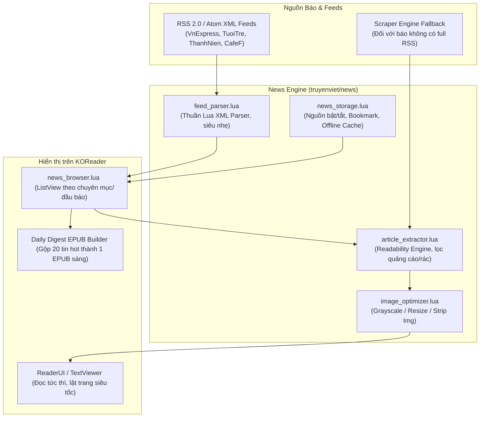
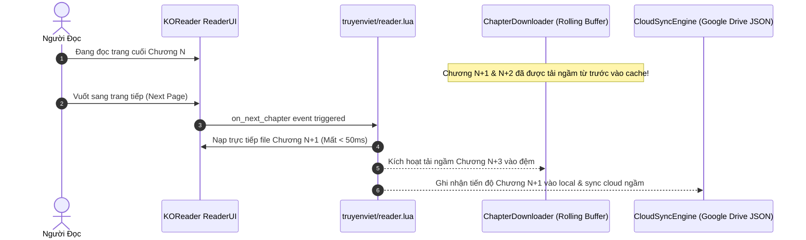
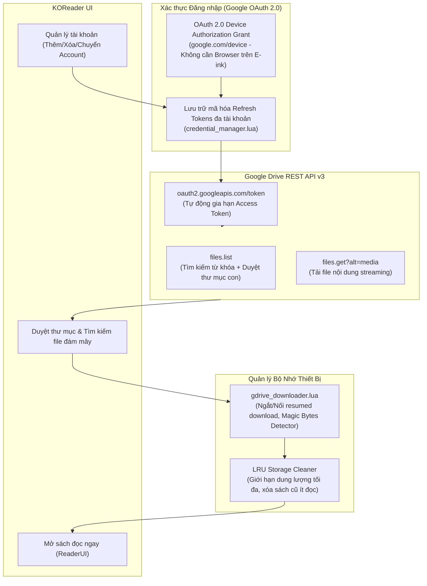

# Đề Xuất & Nghiên Cứu Kỹ Thuật (Feature Research & Technical Proposals)
Dự án: **Z-Truyenviet.koplugin** (Hệ sinh thái Đọc Sách & Tin Tức Tiếng Việt trên KOReader)

---

## MỤC LỤC
1. [📰 Phân Hệ 1: Đọc Báo Online (Online News Reader E-ink)](#1-phân-hệ-1-đọc-báo-online)
2. [📖 Phân Hệ 2: Đọc Truyện Online Nâng Cao (Enhanced Novel & Comic Experience)](#2-phân-hệ-2-đọc-truyện-online-nâng-cao)
3. [☁️ Phân Hệ 3: Kết Nối Google Drive Đám Mây (Advanced Multi-Account Cloud System)](#3-phân-hệ-3-kết-nối-google-drive-đám-mây)
4. [Lộ Trình Triển Khai (Implementation Roadmap)](#4-lộ-trình-triển-khai)

---

## 1. PHÂN HỆ 1: ĐỌC BÁO ONLINE

### 1.1. Mục tiêu & Yêu cầu
- Đọc tin tức thời sự hàng ngày trực tiếp trên máy đọc sách E-ink (Kindle, Kobo, Boox...).
- Đa dạng nguồn báo uy tín: VnExpress, Tuổi Trẻ, Thanh Niên, Dân Trí, VietNamNet, CafeF, Znews, Tiền Phong...
- Phân chia chuyên mục rõ ràng: Chính trị, Thời sự, Xã hội, Thể thao, Kinh doanh - Tài chính, Công nghệ, Thế giới...
- Thao tác nhanh: Đánh dấu bài báo hoặc chuyên mục Yêu thích (Favorites).
- Cá nhân hóa nguồn tin: Ẩn/hiện nguồn báo và chuyên mục theo sở thích đọc.
- Tối ưu hóa phần cứng E-ink: Tùy chọn **"Chỉ đọc chữ (Text-only)"** hoặc **"Tải kèm ảnh (Full Media)"** để tiết kiệm pin, RAM và lật trang tức thì.

### 1.2. Kiến trúc Kỹ thuật Đề xuất



### 1.3. Chi tiết Giải pháp Kỹ thuật
1. **Nguồn cấp RSS/Atom Feeds chuẩn:**
   - Hầu hết các báo lớn tại Việt Nam đều cung cấp RSS công khai có cấu trúc chuẩn:
     * *VnExpress:* `https://vnexpress.net/rss/tin-moi-nhat.rss`, `thoi-su.rss`, `kinh-doanh.rss`
     * *Tuổi Trẻ:* `https://tuoitre.vn/rss/tin-moi-nhat.rss`, `thoi-su.rss`, `the-thao.rss`
     * *Thanh Niên:* `https://thanhnien.vn/rss/home.rss`
     * *CafeF (Tài chính/Chứng khoán):* `https://cafef.vn/thi-truong-chung-khoan.rss`
   - **Ưu điểm:** RSS XML có dung lượng cực nhẹ (chỉ 20-50KB/chuyên mục), phản hồi dưới 0.3s, không dính Cloudflare WAF và không cần render JavaScript.

2. **Bộ bóc tách nội dung (Readability Engine thuần Lua):**
   - Khi người dùng bấm vào một bài báo: Tải URL bài báo và bóc tách phần thân văn bản bài viết (`div.sidebar-1`, `div.content-detail`, `article.fck_detail`...).
   - Loại bỏ triệt để: Quảng cáo (banners), bình luận (comments), bài viết liên quan (related articles), script, video/audio embeds.

3. **Chế độ Text-Only vs Full Media (Tối ưu cho E-ink):**
   - **Text-Only Mode:** Toàn bộ thẻ ``, `<figure>`, `<picture>` được loại bỏ hoặc thay bằng caption text dạng `[Hình ảnh: chú thích]`.
     * *Lợi ích:* Bài báo tải trong 0.2s, bộ nhớ RAM tiêu thụ < 2MB, màn hình E-ink không phải load/scale bitmap nặng.
   - **Full Media Mode:** Giữ ảnh, tự động chuyển về ảnh đơn sắc Grayscale 8-bit hoặc 4-bit E-ink, nén chất lượng 70% qua `ImageUtils` của KOReader.

4. **Tính năng độc đáo: "Tờ báo sáng" (Daily Morning Digest):**
   - Tự động gộp 15-20 bài báo nổi bật nhất từ các danh mục người dùng quan tâm thành **1 file EPUB duy nhất**.
   - Người đọc chỉ cần bấm 1 nút trước khi ra ngoài để có một tờ báo hoàn chỉnh đọc offline suốt ngày.

---

## 2. PHÂN HỆ 2: ĐỌC TRUYỆN ONLINE NÂNG CAO

### 2.1. Mục tiêu & Yêu cầu
- **Tìm kiếm thông minh:** Nhập tên truyện hoặc tên truyện kèm số chương (VD: `"Đấu La Đại Lục 150"` hoặc `"Võ Luyện Đỉnh Phong c3000"`).
- **Lưu truyện đang đọc:** Kệ sách truy cập nhanh (Quick Shelf Drawer) ngay khi đang đọc dở mà không cần thoát về trang chủ.
- **Đồng bộ tiến độ đọc qua Cloud (Progress Sync):** Đồng bộ lịch sử, vị trí chương và % đang đọc giữa các thiết bị thông qua Cloud (Google Drive / WebDAV).
- **Chuyển chương mượt mà (Seamless Reading Transition):** Lật trang cuối chương sẽ nạp chương tiếp theo tức thì không giật lag.

### 2.2. Chi tiết Giải pháp Kỹ thuật



1. **Parser Query Tìm kiếm Thông minh:**
   ```lua
   -- Trích xuất từ khóa và số chương mục tiêu
   local function parseSearchQuery(query)
       local clean = query:gsub("%s+", " ")
       local chap_num = clean:match("[cC]h%a*%s*(%d+)")
           or clean:match("[cC]hap%a*%s*(%d+)")
           or clean:match("[eE]p%a*%s*(%d+)")
           or clean:match("%s+(%d+)$")
       local keyword = clean
       if chap_num then
           keyword = clean:gsub("[cC]h%a*%s*" .. chap_num, "")
                          :gsub("[cC]hap%a*%s*" .. chap_num, "")
                          :gsub("%s+" .. chap_num .. "$", "")
                          :gsub("^%s+", ""):gsub("%s+$", "")
       end
       return keyword, tonumber(chap_num)
   end
   ```
   - Khi người dùng chọn kết quả truyện từ danh sách tìm kiếm: Plugin tự động quét mục lục và cuộn đến chương khớp với `chap_num`.

2. **Đồng bộ Tiến độ Đọc qua Cloud (Cloud Progress Sync):**
   - **Cơ chế lưu trữ:** Sử dụng file `truyenviet_progress_sync.json` lưu trong AppData hoặc thư mục gốc Google Drive của người dùng (thông qua Google Drive AppData API).
   - **Cấu trúc Dữ liệu JSON:**
     ```json
     {
       "device_id": "kobo_clara_2e",
       "last_sync": 1728300000,
       "stories": {
         "truyenfull_dau-pha-thuong-khung": {
           "story_title": "Đấu Phá Thương Khung",
           "source_id": "truyenfull",
           "chapter_url": "https://truyenfull.io/dau-pha-thuong-khung/chuong-1200/",
           "chapter_number": 1200,
           "progress_percent": 0.45,
           "updated_at": 1728299800
         }
       }
     }
     ```
   - **Xử lý Xung đột (Conflict Resolution):** Sử dụng quy tắc so sánh đôi: `max(chapter_number)` và `updated_at`. Thiết bị nào đọc xa hơn hoặc mới hơn sẽ được áp dụng (Last-Write-Wins có kiểm tra số chương).

3. **Dual-Buffer Rolling Prefetch & Tự Động Xóa (Auto-Purge):**
   - Thay vì tải từng chương khi đọc hết (gây trễ 2-5 giây làm đứt mạch đọc của người dùng), cơ chế đệm cuốn chiếu chạy ở chế độ nền:
     * Luôn duy trì sẵn: Chương hiện tại `N`, `N+1`, `N+2`.
     * Khi đọc đến chương `N+1`: Tự động tải ngầm chương `N+3`, đồng thời xóa chương `N - 5` (`PurgeDistance`) để giải phóng dung lượng bộ nhớ.

---

## 3. PHÂN HỆ 3: KẾT NỐI GOOGLE DRIVE ĐÁM MÂY

### 3.1. Mục tiêu & Yêu cầu
- Hỗ trợ tải trực tiếp mọi định dạng ebook: `.epub`, `.cbz`, `.cbr`, `.mobi`, `.pdf`, `.azw3`, `.txt`...
- **Thêm không giới hạn tài khoản Google Drive** (Personal, Work, Team Drive/Shared Drive).
- Tìm kiếm file, sách trực tiếp từ Google Drive trên giao diện KOReader.
- Duyệt cây thư mục Google Drive (Folder Navigation) như một ổ đĩa cục bộ.
- **Tiết kiệm bộ nhớ máy:** Sách lưu trên Cloud, chỉ tải về cache cục bộ khi đọc và tự động dọn rác LRU.

### 3.2. Kiến trúc Kết nối Google Drive



### 3.3. Phương Pháp Xác Thực: Google Device Authorization Flow
Trên máy đọc sách E-ink (không có trình duyệt đầy đủ, bàn phím gõ chậm), việc đăng nhập web thông thường rất bất tiện. Giải pháp chuẩn mực và tối ưu nhất là **Google Device Authorization Grant** (RFC 8628, tương tự YouTube trên Smart TV hay GitHub CLI):

1. **Bước 1:** Plugin gửi yêu cầu tới:
   ```http
   POST https://oauth2.googleapis.com/device/code
   client_id={GOOGLE_CLIENT_ID}&scope=https://www.googleapis.com/auth/drive.readonly
   ```
2. **Bước 2:** Google trả về `user_code` (VD: `WDJB-NFLM`) và `verification_url` (`https://www.google.com/device`).
3. **Bước 3:** KOReader hiển thị Popup kèm **Mã QR code**:
   > *"Vui lòng mở điện thoại quét mã QR hoặc truy cập https://google.com/device và nhập mã: WDJB-NFLM"*
4. **Bước 4:** Plugin poll định kỳ 5 giây/lần. Ngay khi người dùng nhấn "Cho phép" trên điện thoại, plugin nhận về `refresh_token` vĩnh viễn và lưu trữ an toàn.

### 3.4. Quản lý Đa Tài Khoản Không Giới Hạn
- Cấu trúc lưu trữ đa tài khoản trong `storage.lua`:
  ```lua
  {
      active_account_id = "acc_1",
      accounts = {
          {
              id = "acc_1",
              name = "Drive Cá Nhân",
              email = "user@gmail.com",
              refresh_token = "obf:...",
              created_at = 1728300000,
          },
          {
              id = "acc_2",
              name = "Kho Truyện Tranh (Shared)",
              email = "comic_fan@gmail.com",
              refresh_token = "obf:...",
              created_at = 1728310000,
          }
      }
  }
  ```
- Menu chuyển đổi tài khoản 1 chạm (Quick Switcher) cho phép chọn kho lưu trữ bất kỳ lúc nào.

### 3.5. Duyệt & Tìm Kiếm File trên Google Drive API v3
- **Duyệt Thư Mục:**
  ```http
  GET https://www.googleapis.com/drive/v3/files?q='{folder_id}'+in+parents+and+trashed=false&fields=files(id,name,mimeType,size,iconLink)
  ```
- **Tìm Kiếm Toàn Cục Sách:**
  ```http
  GET https://www.googleapis.com/drive/v3/files?q=name+contains+'{keyword}'+and+trashed=false&fields=files(id,name,mimeType,size)
  ```
- **Bộ Lọc Ebook Tự Động:**
  Hệ thống tự động lọc ra các file có đuôi `.epub`, `.cbz`, `.cbr`, `.mobi`, `.pdf`, `.azw3`, `.txt` hoặc có MIME type:
  * `application/epub+zip`
  * `application/pdf`
  * `application/x-mobipocket-ebook`
  * `application/vnd.comicbook+zip`

### 3.6. Cơ Chế Tiết Kiệm Bộ Nhớ (Zero-Storage Footprint)
- Bộ nhớ máy đọc sách thường giới hạn (4GB - 16GB). Sách tải về được lưu tại thư mục đệm `koreader/truyenviet/cache/gdrive/`.
- **Cấu hình Dung Lượng Đệm Tối Đa (Max Cache Size):** Cho phép đặt giới hạn (ví dụ: 1GB).
- **Thuật toán LRU (Least Recently Used):** Khi dung lượng bộ nhớ đệm chạm ngưỡng tối đa, hệ thống tự động xóa các file sách cũ nhất đã tải mà không làm mất bookmark hay tiến độ đọc sách của người dùng.

---

## 4. LỘ TRÌNH TRIỂN KHAI (IMPLEMENTATION ROADMAP)

| Giai Đoạn | Phân Hệ | Nội Dung Triển Khai | Kết Quả Đầu Ra |
| :---: | :--- | :--- | :--- |
| **P1** *(Đã hoàn thành)* | **Core Fix & GDrive Public** | Sửa triệt để 15 test suite, coroutine yield, sorting logic, viết `gdrive_downloader.lua`, menu tải GDrive công khai. | Mã nguồn sạch 100% test pass, tải link GDrive public mượt mà. |
| **P2** | **Google Drive OAuth & Browser** | Tích hợp OAuth 2.0 Device Flow, quản lý đa tài khoản, giao diện duyệt cây thư mục & tìm kiếm sách trên Google Drive. | Đăng nhập tài khoản cá nhân, xem và tải mọi ebook từ kho Drive của mình. |
| **P3** | **Đọc Báo Online (News)** | Xây dựng `feed_parser.lua`, tích hợp 8+ nguồn báo lớn (VnExpress, Tuổi Trẻ...), chế độ Text-Only vs Full Media, Daily Digest EPUB. | Xem tin tức thời sự hàng ngày siêu nhanh, không tốn pin. |
| **P4** | **Đọc Truyện Online Cải Tiến** | Parser tìm kiếm theo tên + chương, Dual-buffer rolling prefetch, Cloud progress sync qua Google Drive AppData. | Trải nghiệm đọc truyện không độ trễ, đồng bộ tiến độ xuyên thiết bị. |
